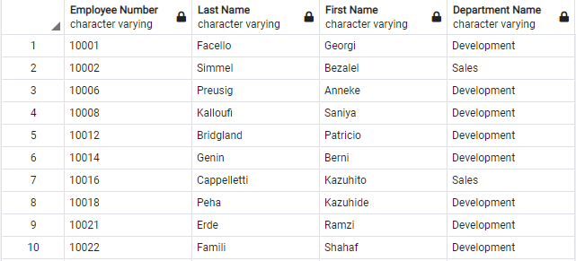

# SQL Homework - Employee Database: A Mystery in Two Parts

It is a beautiful spring day, and it is two weeks since you have been hired as a new data engineer at Pewlett Hackard. Your first major task is a research project on employees of the corporation from the 1980s and 1990s. All that remain of the database of employees from that period are six CSV files.

In this assignment, you will design the tables to hold data in the CSVs, import the CSVs into a SQL database, and answer questions about the data. In other words, you will perform:

1. Data Engineering
2. Data Analysis


# Assignment structure
```
sql-challenge
|__ data/                     # contains clean data files
|   |__ departments.csv       # clean data
|   |__ dept_emp.csv          # clean data
|   |__ dept_manager.csv      # clean data
|   |__ employees.csv         # clean data
|   |__ salaries.csv          # clean data
|   |__ titles.csv            # clean data
|
|__ EmployeeSQL/              # contains pgadmin sql files
|   |__ queries.sql           # query analysis schema
|   |__ QuickDBDExport.sql    # ERD export from QuickDBD in postgres format
|   |__ table_schema.sql      # create table schema
|
|__ images/
|   |__ Average_Salary_ByTitle_BarChart.png        # Matplotlib pyplot Bar chart
|   |__ Common_Salary_Ranges_Histogram.png         # Matplotlib pyplot Histogram
|   |__ csv_files.PNG                              # clean csv files for tables and analysis
|   |__ DataModeling_ERD.png                       # Entity Relationship Model
|   |__ epilogue.PNG                               # Query output table
|   |__ question1.PNG                              # Query output table
|   |__ question2.PNG                              # Query output table
|   |__ question3.PNG                              # Query output table
|   |__ question4.PNG                              # Query output table
|   |__ question5.PNG                              # Query output table
|   |__ question6.PNG                              # Query output table
|   |__ question7.PNG                              # Query output table
|   |__ question8.PNG                              # Query output table
|
|__ notebooks/
|   |__ sqlalchemy.ipynb        # sqlalchemy jupyter notebook that contains charts for most common salary and average salary by title

```


# Usage

```
# Pandas
import pandas as pd

# Dependencies
import matplotlib.pyplot as plt
import numpy as np
import scipy.stats as stats

# SQLAlchemy
from sqlalchemy import create_engine

```

# Datasets 

|No|Source|Link|
|-|-|-|
|1|departments.csv|https://github.com/alysnow/sql-challenge/blob/main/data/departments.csv|
|2|dept_emp.csv|https://github.com/alysnow/sql-challenge/blob/main/data/dept_emp.csv|
|3|dept_manager.csv|https://github.com/alysnow/sql-challenge/blob/main/data/dept_manager.csv|
|4|employees.csv|https://github.com/alysnow/sql-challenge/blob/main/data/employees.csv|
|5|salaries.csv|https://github.com/alysnow/sql-challenge/blob/main/data/salaries.csv|
|6|titles.csv|https://github.com/alysnow/sql-challenge/blob/main/data/titles.csv|


# Data Modeling

Inspect the CSVs and sketch out an ERD of the tables. 

### Data:


### Entity Relationship Model:


The ERD was generated using the QuickDBD tool in the following link; http://www.quickdatabasediagrams.com


# Data Engineering

Utilizing the QuickDBD tool to generate the ERD, the table schema for each of the six CSV files is assembled including the data types, primary keys, foreign keys, and any other constraints. 
All 6 csv files are imported into the subsequent SQL table. A copy of the table schema is located in the following link;

https://github.com/alysnow/sql-challenge/blob/main/EmployeeSQL/table_schema.sql


# Data Analysis

The following querys have been executed in the following queries.sql file;

https://github.com/alysnow/sql-challenge/blob/main/EmployeeSQL/queries.sql


### Question 1: List the following details of each employee: employee number, last name, first name, sex, and salary.


### Question 2: List first name, last name, and hire date for employees who were hired in 1986.


### Question 3: List the manager of each department with the following information: department number, department name, the manager's employee number, last name, first name.


### Question 4: List the department of each employee with the following information: employee number, last name, first name, and department name.


### Question 5: List first name, last name, and sex for employees whose first name is "Hercules" and last names begin with "B."


### Question 6: List all employees in the Sales department, including their employee number, last name, first name, and department name.


### Question 7: List all employees in the Sales and Development departments, including their employee number, last name, first name, and department name.




### Question 8: In descending order, list the frequency count of employee last names, i.e., how many employees share each last name.


# Epilogue

Evidence in hand, you march into your boss's office and present the visualization. With a sly grin, your boss thanks you for your work. On your way out of the office, you hear the words, "Search your ID number." You look down at your badge to see that your employee ID number is 499942.


# Histogram

### Most Common Salary Ranges for Employees


# Bar Chart

### Average Salary by Title


# Contributor
- [Alysha Snowden](https://github.com/alysnow)